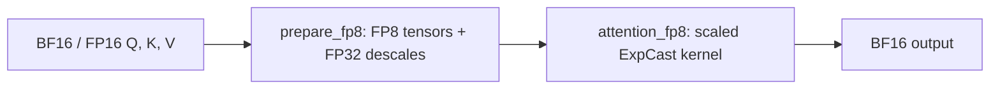

# How the package fits together

The public call takes BF16/FP16 Q/K/V and returns a BF16 attention output.
It quantizes Q and K in 128-token blocks per head, and V per head per sequence.
FP32 descales retain each block/head's magnitude. The kernel consumes the FP8
values plus these descales, then computes dense attention with ExpCast enabled.

`attention(q,k,v)` covers the entire flow. `prepare_fp8` followed by
`attention_fp8` exposes the preparation boundary for existing FP8 pipelines
and attention-only benchmarks. Prepared tensors must be rebuilt when activations
change. Automatic V packing remains inside the attention call.

ExpCast changes the representation of softmax probabilities used by the PV
multiply. The scaled implementation also enables a fused path for eligible
large calls with external descales. Its gain combines packing, normalization,
rescaling and probability publication. A measured speedup is not an isolated
measurement of one exponential instruction. The operation remains approximate;
all attention tiles are evaluated by default.

The default is `v4` ExpCast with `mid_window_blocks=4`. Eligible B200 calls use
the source-level fusedpipe schedule; the experimental D SASS patch is disabled.
The large fused path requires a noncausal, single sequence with both Q and K
lengths at least 32768, D=128, no LSE request and CuTe DSL 4.6.0 on SM100/SM103.
B300 additionally requires `S_q * H >= 1048576`; current dense B200 FP8 calls
do not have that work threshold. These are necessary conditions;
the [dispatch code](../src/vc_attn/_kernels/v4/flash_attn/cute/interface.py)
checks the remaining layout and feature constraints. Other supported calls use
the general kernel path and need their own performance measurements.

On that fused path, ExpCast forms FP8 probability codes with Q/K descales,
V packing supplies the required Tensor Core layout, and Tensor Core accumulation
also produces the normalizer. Inline output rescaling, segmented probability
publication and warp reuse reduce additional data movement and synchronization.
Turning ExpCast on can select all of these changes together; the `fp8_control`
comparison is a configuration comparison rather than a single-instruction ablation.

| Layer | Responsibility | Entry point |
|---|---|---|
| Public API | Shapes, dtypes, inference contract, preparation and source selection | [api.py](../src/vc_attn/api.py) |
| Frozen kernels | CuTe DSL device code and launch/dispatch policy | [_kernels/v4/](../src/vc_attn/_kernels/v4/README.md) |
| Quantization | Attention-specific block/head FP8 preparation | [quantization.py](../src/vc_attn/quantization.py) |
| Native baseline | Optional independent B300 CUDA v6 and plan lifetime | [native/](../src/vc_attn/native/README.md) |
| Measurement | Matched inputs, randomized paired rounds, accuracy and JSON | [benchmark.py](../src/vc_attn/benchmark.py) |
| Framework adapter | Calls local attention between the framework's communication stages | [integrations/](../src/vc_attn/integrations/README.md) |

The framework owns weights, RoPE, Q/K normalization, sequence-parallel exchange,
KV caches and request scheduling. This repository owns only attention and its
measurement/integration helpers. It does not install process-wide compiler
patches or replace framework attention globally.

Frozen baseline source keeps performance comparisons stable. Exact original
and namespace-adjusted file hashes live in
[source_manifest.json](../src/vc_attn/source_manifest.json). Historical source
revisions and dispatch details are in the [appendix](appendix/versions.md).

[Repository](../README.md) · [Documentation](README.md)
