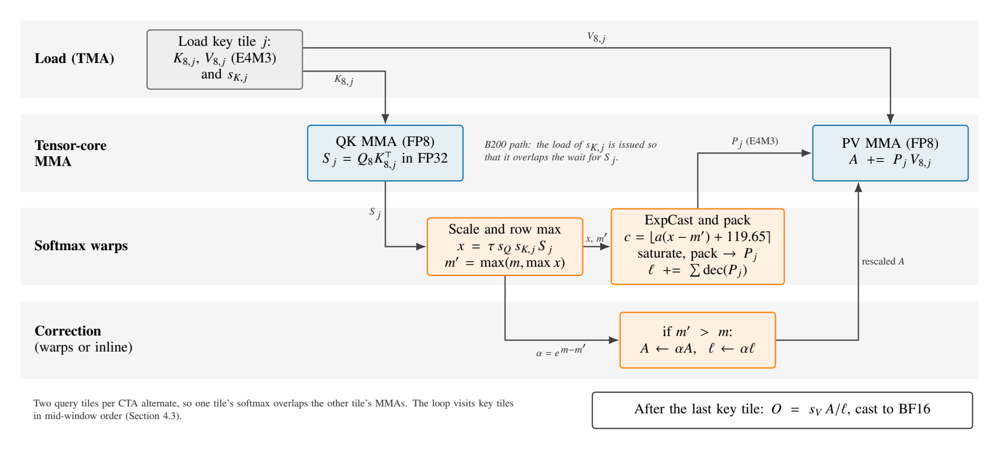
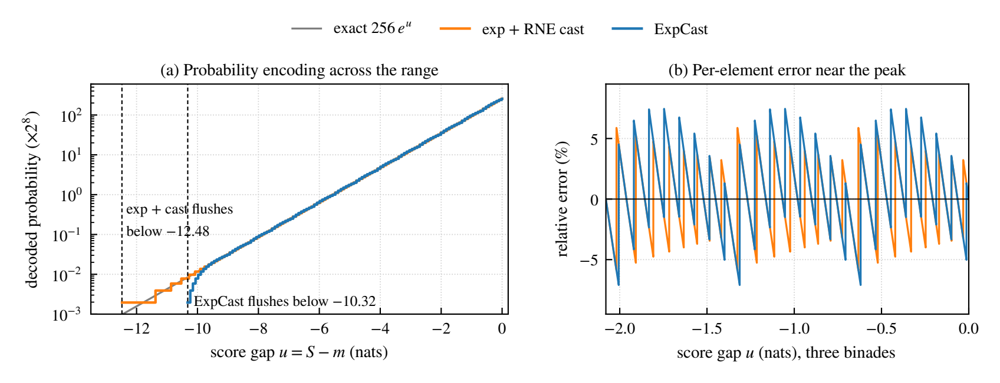
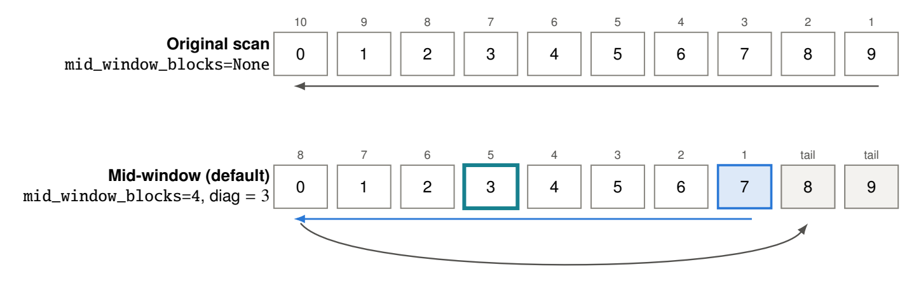
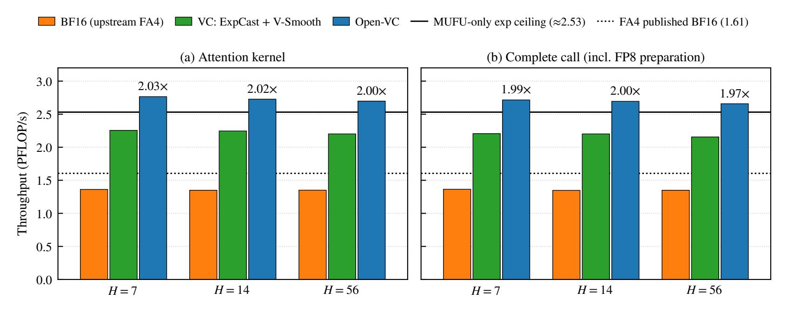
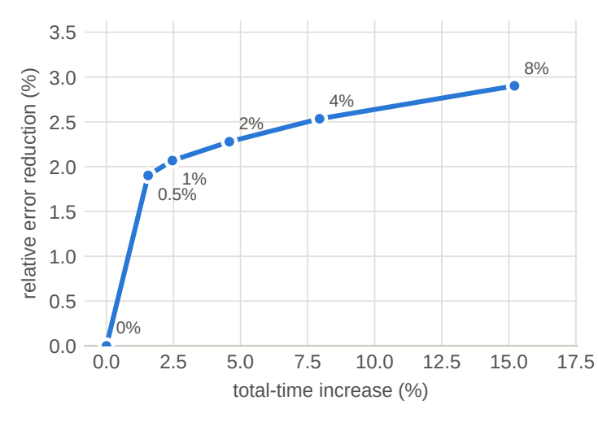

# Open-VC Attention: FP8 attention with softmax casting for long-sequence video diffusion on NVIDIA Blackwell

**MachGen AI** · Technical report · October 2026

Code: <https://github.com/MachGen/open-vc-attention> · Package: `open-vc-attn` · License: BSD-3-Clause

A typeset version of this report is available as a [PDF](Open-VC-Attention-Technical-Report.pdf).

## Abstract

Attention dominates the cost of long-sequence video diffusion transformers. On NVIDIA Blackwell, FP8 doubles tensor-core throughput but not exponential throughput, so a straightforward FP8 attention kernel is limited by the softmax rather than by matrix multiplication. Open-VC Attention is an open-source FP8 forward-attention kernel for B200 and B300, built on the FlashAttention-4 CuTe DSL kernel. It adopts *ExpCast* from VC-Attention, which writes E4M3 probability codes directly from scores without an exponential, and schedules the kernel around it: scales folded into score conversion, a mid-window key traversal that settles the running maximum early, a packed-$V$ pipeline and fused input preparation. A budgeted $V$ residual repair gives a tunable accuracy–time trade-off. On B200, with activations captured from a MiniMax-H3 video model, the attention kernel sustains 2.70–2.76 PFLOP/s: 2.00–2.03× faster than upstream BF16 FlashAttention-4 (1.97–2.00× including FP8 preparation) and 1.21–1.23× faster than the VC-Attention method on the same kernel family, at 2.98–3.19% relative $L_2$ error. A 0.5% repair budget lowers that error by 1.90% for 1.55% more time.

## 1 Introduction

Video diffusion transformers [1] such as Wan [2], LongCat-Video, HunyuanVideo-1.5 and MiniMax-H3 [3] apply full spatio-temporal self-attention over every latent token. An 81-frame 720p Wan2.1/2.2 clip already has 75,600 tokens, and attention cost grows quadratically with that count. VC-Attention reports that a 1.59× faster kernel yields a 1.19× end-to-end speedup on B200 [3], which puts attention at about 43% of generation time (Appendix B).

On B200, dense FP8 tensor-core throughput (4.5 PFLOP/s) is twice the BF16 rate [4], but the multi-function unit (MUFU) that evaluates exponentials did not scale with it: about $4.9\times10^{12}$ `exp2`/s on GB200 [5]. At $D=128$ each score carries 512 FLOPs of matrix work, so a kernel that sends every exponential through MUFU is capped near 2.53 PFLOP/s, 56% of the FP8 peak (Section 2.3).

VC-Attention [3] removes that bottleneck with *ExpCast-FP8*: because a floating-point bit pattern is approximately affine in its logarithm [6, 7], an E4M3 probability code can be computed from a score with one fused multiply-add, skipping both the exponential and the FP32-to-FP8 conversion. The paper pairs ExpCast with the *V-Smooth* value-grouping scheme; Nunchux AI reports a proprietary kernel built on these ideas [8].

This report describes **Open-VC Attention**, our open-source (BSD-3-Clause) FP8 attention kernel for Blackwell, inspired by VC-Attention, that implements ExpCast inside the FlashAttention-4 CuTe DSL kernel [4, 9]. Our contributions are:

- **An FP8 forward kernel for SM100 and SM103 with a documented numerical contract**: per-block $Q/K$ and per-head $V$ scales folded into score conversion, ExpCast probabilities, and a softmax denominator built from the same decoded probabilities that feed the $PV$ product (Sections 4.1 and 4.2).
- **Scheduling and data layout around ExpCast**: a mid-window key traversal that establishes the running maximum early, as ExpCast's zero rescale deadband requires (Section 4.3); a warp-specialized pipeline with a B200 scale/score overlap (Section 4.4); a packed $V$ layout (Section 4.5); and a fused three-kernel input preparation (Section 4.6).
- **$V$ residual repair**, a budgeted correction that re-adds the quantization residual of the worst-rounded value tokens through extra FP8 key rows, giving a tunable accuracy–time trade-off (Section 4.9).
- **A numerical characterization** of ExpCast and an analysis of why V-Smooth is optional at FP8 (Sections 4.2 and 4.8), and a measured comparison against BF16 FlashAttention-4 and the VC-Attention method on captured video-model activations (Section 5).

> **Scope.** Forward inference; head dimension 128; multi-head attention (equal $Q$, $K$, $V$ head counts); the packed FP8 path is non-causal and needs both sequence lengths $\geq 32{,}768$. Other supported calls use a general path with the same semantics; gradients, GQA layouts and other head dimensions fail explicitly.

## 2 Background

### 2.1 Attention and the online softmax

For one head with $Q\in\mathbb{R}^{S_q\times D}$ and $K,V\in\mathbb{R}^{S_k\times D}$, attention computes $O=\operatorname{softmax}(\tau QK^{\top})V$ with $\tau=1/\sqrt{D}$ [10]. FlashAttention [11, 12] streams $K$ and $V$ in 128-key tiles and keeps a running row maximum $m$, denominator $\ell$ and unnormalized accumulator $A$ per query row. For key tile $t$ with scores $S_t$, the online softmax [13, 14] updates

$$
\begin{aligned}
m^{(t)} &= \max\!\big(m^{(t-1)},\ \operatorname{rowmax} S_t\big), &
\alpha^{(t)} &= e^{\,m^{(t-1)}-m^{(t)}}, \\
P_t &= e^{\,S_t-m^{(t)}}, &
\ell^{(t)} &= \alpha^{(t)}\,\ell^{(t-1)}+\operatorname{rowsum} P_t,\\
A^{(t)} &= \alpha^{(t)}A^{(t-1)}+P_tV_t, &
O &= A^{(T)}/\ell^{(T)}. 
\end{aligned} \tag{1}
$$

Whenever the maximum grows, earlier contributions are rescaled by $\alpha<1$; we call this the *correction*. The matrix work per tile is $QK^{\top}$ and $PV$; everything else (scaling, maxima, exponentials, row sums, corrections) is elementwise.

### 2.2 The E4M3 floating-point format

E4M3 [15] has 1 sign, 4 exponent (bias 7) and 3 mantissa bits. The "FN" variant on NVIDIA tensor cores has no infinities: `0x7F` is NaN, the largest finite value is $448$, the smallest normal $2^{-6}$ and the smallest subnormal $2^{-9}$. A positive normal value with exponent field $E\in[1,15]$ and mantissa $M\in[0,7]$ is

$$
v=2^{E-7}\left(1+\tfrac{M}{8}\right),\qquad \text{stored as the byte } c=8E+M. \tag{2}
$$

Round-to-nearest-even (RNE) has a worst-case relative error of $1/17\approx5.9\%$ (RMS about 2.6%), and this relative precision holds across the whole normal range ($448/2^{-6}\approx28{,}700\times$, about $2^{14.8}$). FP8 is therefore much less sensitive to scale granularity than INT8 (Section 4.1).

### 2.3 The exponential budget on Blackwell

From Hopper to Blackwell, BF16 tensor-core throughput rises from 1 to 2.25 PFLOP/s while special-function units and shared-memory bandwidth stay flat. FlashAttention-4 (FA4) [4] answers with software `exp2` on FMA units alongside `MUFU.EX2`, conditional rescaling and warp specialization, reaching 1,605 TFLOP/s BF16 on B200 [16].

Table 1 carries this accounting to FP8: the dense FP8 peak would need 178% of measured MUFU throughput, so a MUFU-only kernel is capped at 2.53 PFLOP/s before any scaling, conversion or correction work. Blackwell Ultra (B300) doubles MUFU throughput [5], raising the ceiling to $\approx$5.1 PFLOP/s, which is why exponential-avoiding techniques are expected to help less there.

**Table 1.** Exponential budget for $D=128$ attention. MUFU throughputs are microbenchmarks on GB200 and GB300 [5]; the B200 BF16 peak is from [4] and FP8 is twice that. HGX B200 clocks may differ from GB200's, so the B200 ceiling is approximate. The ceiling is $R_{\exp}\cdot4D$.

| Quantity | B200 class | B300 class |
|---|:-:|:-:|
| Dense BF16 / FP8 tensor-core throughput | 2.25 / 4.5 PFLOP/s | not used here |
| Measured MUFU `exp2` throughput $R_{\exp}$ (FP32) | $4.94\times10^{12}$/s | $10.02\times10^{12}$/s |
| Exponentials needed at the BF16 peak | $4.4\times10^{12}$/s (89% of $R_{\exp}$) | — |
| Exponentials needed at the FP8 peak | $8.8\times10^{12}$/s (178% of $R_{\exp}$) | — |
| **MUFU-only attention ceiling** | **2.53 PFLOP/s** | **$\approx$5.1 PFLOP/s** |

### 2.4 Workload shapes

Wan's VAE compresses video $4\times$ in time and $8\times$ spatially, and the transformer uses $1\times2\times2$ patches [2], so an 81-frame clip has 21 latent frames: $21\times30\times52=32{,}760$ tokens at $480\times832$ and 75,600 at $720\times1280$. We evaluate Q/K/V captured from a MiniMax-H3 denoising step, of shape $[73{,}397,\,56,\,128]$, together with its first 7 and 14 heads. Under Ulysses sequence parallelism [17], a 56-head model on 8 GPUs attends with 7 heads per GPU, hence $H=7$ alongside $H=56$.

## 3 Related work

#### Exact, IO-aware attention.

FlashAttention [11] keeps the score matrix on chip; FlashAttention-2 [12] improves work partitioning; FlashAttention-3 [18] adds Hopper warp specialization and an FP8 path with block quantization and Hadamard rotation. FlashAttention-4 [4], written in the CuTe DSL [9], co-designs the pipeline for Blackwell and reports 1.1–1.3× over cuDNN 9.13 in BF16 forward [16]. Open-VC is derived from FA4's SM100 forward kernel.

#### Low-bit attention.

SageAttention [19] quantizes $Q$ and $K$ to INT8 after subtracting the token-mean of $K$, which leaves the softmax unchanged. SageAttention2 [20] adds INT4 $Q/K$ and an FP8 $PV$ product; SageAttention3 [21] brings microscaling [22] FP4 to Blackwell. Meta's LP-FA4 [23] runs FA4 end to end in MXFP8 and reports 2.85 PFLOP/s forward versus 2.00 PFLOP/s BF16 on GB300. All of these compute an explicit FP32 exponential and quantize $P$ afterwards; Open-VC, following VC-Attention, never does.

#### Exponential approximations.

Mitchell [6] observed that a float's bit pattern is a piecewise-linear approximation of its logarithm; Schraudolph [7] inverted this to approximate $e^{y}$ by writing a scaled integer into the exponent field. ExpCast-FP8 [3] applies that construction in the E4M3 code space.

#### VC-Attention and Nunchux Attention.

VC-Attention [3] combines ExpCast-FP8 with V-Smooth, which clusters value tokens by online $k$-means, subtracts 128-row block means before quantizing $V$ and restores them through the softmax row sums. It reports 1.59× over BF16 FA4 on B200 at 8 bits and a mean PSNR of 20.2 dB on 100 MiniMax-H3 prompts (19.9 dB for SageAttention2). Nunchux AI's proprietary kernel reports 1.91× on B200 and 1.83× on B300 [8]. Open-VC implements ExpCast but not V-Smooth (Section 4.8), and is an implementation inspired by the published paper.

#### Orthogonal techniques.

Sparse attention such as Sparse VideoGen [24] and SpargeAttention [25] reduces the number of scores rather than their precision and could be combined with an FP8 kernel; Open-VC is dense. Sequence parallelism [17] and serving frameworks such as SGLang [26] sit around the kernel; Open-VC ships an optional SGLang patch (Appendix A).

**Table 2.** How each method produces the probabilities $P$, and what it reports. Speedups are each method's own measurement on its own shapes, GPUs and baselines and are *not* directly comparable.

| Method | Operand formats | How $P$ is produced | Reported result (conditions) |
|---|---|---|---|
| FA4 [4] | BF16 | FP32 exp: MUFU + FMA emulation | 1,605 TFLOP/s, B200 BF16 [16] |
| LP-FA4 [23] | MXFP8 $Q,K,V$ | FP32 exp, then online MXFP8 cast | 2.85 vs 2.00 PFLOP/s fwd (LLM shapes, GB300) |
| VC-Attention [3] | FP8 $Q,K$; FP8/NVFP4 $V$ + V-Smooth | ExpCast-FP8 | 1.59× B200 [3], 1.51× B300 [8] vs BF16 FA4 |
| Nunchux Attention [8] | proprietary | proprietary | 1.91× B200, 1.83× B300 vs BF16 FA4 |
| **Open-VC (this work)** | FP8 $Q,K$ per 128-token block; FP8 $V$ per head; optional $V$ repair | ExpCast-FP8, zero deadband | 2.00–2.03× B200 attention kernel, 1.97–2.00× complete call, vs upstream FA4 BF16 (Section 5) |

## 4 Design and optimizations

Open-VC keeps FA4's overall structure [4]. Each CTA owns two 128-row query tiles ("query stages") and streams 128-key tiles of $K$ and $V$ through shared memory. Specialized warps issue the loads, issue the tensor-core matrix products and run the softmax for each query stage. Output corrections run either in dedicated warps or inline, depending on the schedule. Figure 1 shows one iteration of the main loop as Open-VC schedules it. The subsections below explain every change relative to a straightforward FP8 port of FA4. Numerics come first (Sections 4.1, 4.2 and 4.3), then scheduling and data layout (Sections 4.4, 4.5, 4.6 and 4.7). The section closes with $V$ accuracy: why we leave out VC-Attention's V-Smooth (Section 4.8), and the $V$ residual repair we use instead (Section 4.9).



**Figure 1.** One iteration of the Open-VC main loop for one 128-row query tile. Blue marks tensor-core work, orange marks non-matmul work on CUDA cores (the expected bottleneck on B200; Table 1), and gray marks data movement. $\lfloor\cdot\rceil$ is round-to-nearest, $a=8\log_2 e$ and $\operatorname{dec}(\cdot)$ decodes E4M3 bytes; in the kernel the scale multiplications are folded into the same operations. The probability path is designed to avoid the hardware exponential and a separate FP32$\to$FP8 conversion.

### 4.1 Quantization with scales folded into score conversion

#### Scales.

For a quantization group $X$ with $a=\max|X|$, Open-VC uses the FP32 scale $s_X=a/448$, with a small positive floor so that an all-zero group stays zero, and stores $X_8=\operatorname{RNE}_{\text{E4M3}}(X/s_X)$. The reconstruction is $\hat X=s_X X_8$. $Q$ and $K$ use one group per (sequence, head, 128-token block), giving scale tensors of shape $[B,H,\lceil S/128\rceil]$. $V$ uses one group per (sequence, head), giving $[B,H]$. Batched and packed calls quantize each sequence separately so that no group spans two sequences, and a final partial block is masked.

*Example.* If a block's largest magnitude is 3.5, then $s=3.5/448=0.0078125$. The value $1.0$ maps to $128$, which E4M3 represents exactly. The value $0.3$ maps to $38.4$; E4M3 values in $[32,64)$ are spaced 4 apart, so it rounds to $40$ and reconstructs as $0.3125$, a 4.2% error. That error size is typical of three mantissa bits.

#### Folding.

The FP8 matrix product returns $\langle Q_{8,i},K_{8,j}\rangle$ in FP32. The true score is

$$
S_{ij}=\tau\; s_Q\big(b(i)\big)\; s_K\big(b(j)\big)\;\langle Q_{8,i},K_{8,j}\rangle, \tag{3}
$$

where $b(\cdot)$ is the 128-token block index. Open-VC never materializes dequantized $Q$ or $K$. It applies the multiplier $\tau s_Qs_{K,j}$ inside score conversion: $\tau s_Q$ is fixed for a query tile, and $s_{K,j}$ changes with every key tile.

#### A subtle requirement: the running maximum must live in the scaled domain.

Raw tile maxima from two key tiles are not comparable when the tiles have different scales. Suppose tile A has raw maximum 100 with $s_K=0.01$ (true maximum $1.0$) and tile B has raw maximum 50 with $s_K=0.05$ (true maximum $2.5$). Comparing raw values picks A, but the true maximum is in B, and probabilities computed against the wrong maximum would saturate or overflow the FP8 code range. Open-VC's `update_row_max` therefore multiplies each raw tile maximum by that tile's $K$ descale before merging it into the running maximum. This is valid because descales are positive. The conversion then uses the same folded multiplier (`scale_subtract_rowmax` and `apply_exp2_convert` in `softmax.py`).

#### $V$ scale.

$s_V$ is constant over the whole key loop, so it can be applied on the output accumulation and normalization path (mathematically, $O=s_V A/\ell$). A single scale per head is coarser than VC-Attention's per-channel $V$ scales. In E4M3 this matters much less than in INT8, because relative precision does not depend on the scale while values stay in the normal range ($28{,}700\times$; Section 2.2). Per-channel scales would cost the same, one vector multiply in the epilogue, but would only help channels more than four orders of magnitude below the head's maximum. The residual that the per-head scale does leave is what $V$ repair targets (Section 4.9).

### 4.2 ExpCast: casting scores directly to FP8 probability codes

#### The standard FP8 path.

In a conventional FP8 kernel, each score $x$ goes through four steps: subtract the running maximum and scale by $\log_2 e$ (one FMA), exponentiate (`MUFU.EX2` or a software polynomial), convert FP32 to E4M3 (one conversion instruction per two values), and add to the row sum. On B200 the exponential is the step that does not keep up with the tensor cores (Table 1).

#### The key observation.

For a positive normal E4M3 value, Eq. (2) gives $\log_2 v=E-7+\log_2(1+M/8)$. Mitchell's approximation $\log_2(1+y)\approx y$ [6] turns this into

$$
c \;=\; 8E+M \;\approx\; 8\log_2 v+56 . \tag{4}
$$

The byte of an E4M3 number is approximately an affine function of the number's logarithm. To produce a probability we can therefore compute its *byte* directly from the score, without forming the probability as an FP32 number first.

#### ExpCast.

Let $u=x-m\le0$ be the gap between a score and the running maximum, and target the scaled probability $v=2^{8}e^{u}$ (the factor $2^8$ is explained below). Substituting into Eq. (4) and adding the bias correction $\beta=-0.35$, which centers the approximation error as in Schraudolph's method [7] ($0.35\approx8\times0.043$), gives

$$
c=\operatorname{clamp}\!\Big(\big\lfloor\, 8\log_2(e)\,u+119.65\,\big\rceil,\ 0,\ 120\Big),\qquad P=\operatorname{bitcast}_{\text{E4M3}}(c), \tag{5}
$$

with $119.65=8\cdot8+56+\beta$. This is the code-space form of VC-Attention's Eq. 7 [3], which clips codes to $[0,120]$; Open-VC likewise saturates the code to a valid range before packing. In the kernel, the scale and bias are folded ($\tau s_Qs_{K,j}$, $\log_2 e$, the factor 8 and $-m$) so that codes come out of FP32 fused multiply-adds. Rounding uses FMA mantissa alignment, and byte permutes pack four codes into one 32-bit register (`pack4_expcast_e4m3` in `utils.py`; scale and bias in `softmax.py`). The probability path therefore avoids `MUFU.EX2` and a separate FP32-to-FP8 conversion. These instruction-level details determine the rounding, so a mathematically similar expression is not a drop-in replacement without GPU regression tests.

*Worked examples.* For $u=-1$, the exact scaled probability is $256e^{-1}=94.18$. The raw code is $108.11$, which rounds to $108$, i.e. $E=13$, $M=4$, value $96$. Exponentiating and then rounding gives the same byte. For $u=-0.17$, the exact value is $215.98$. ExpCast's raw code $117.69$ rounds to $118$ (value $224$, $+3.7\%$), while exponentiating and then rounding gives byte $117$ (value $208$, $-3.7\%$). The two schemes place rounding boundaries differently inside each binade.

#### Why scale by $2^8$.

Code 120 (`0x78`) decodes to exactly $256=2^8$ (`max_offset`$\,=8$), the largest power of two below E4M3's maximum of 448. Keeping probabilities in $[0,1]$ would push everything below $2^{-6}$ into E4M3's subnormal range or to zero. Scaling by 256 moves small probabilities into the normal range, and the common factor cancels in the normalization.



**Figure 2.** ExpCast versus exponentiate-then-round (exact $e^{u}$ followed by an RNE cast to E4M3), both scaled by $2^8$. (a) Over most of the range the two encodings overlap; ExpCast flushes to zero about 2.2 nats earlier. (b) Within each binade, ExpCast's linear code map gives a slightly wider sawtooth: $-7.1$% to $+$7.5% versus $\pm$5.9% for RNE. Both are simulated bit-exactly with `ml_dtypes` (Appendix B).

**Table 3.** ExpCast numerics, simulated bit-exactly against exponentiate-then-round (Appendix B). $u$ is the score gap to the running maximum in nats.

| Property | ExpCast | exp + RNE cast |
|---|:-:|:-:|
| Same byte as exp + RNE cast, $u\in[-9.7,0]$ (normal codes) | 79.6% | — |
| Per-element relative error, normal range | $-7.1$% … $+$7.5% | $\pm$5.9% |
| RMS relative error, normal range | 3.30% | 2.65% |
| Flushed to zero below | $u<-10.32$ | $u<-12.48$ |
| Subnormal codes 1–7 (decoded / intended) | 0.22–0.93 | exact |

#### Measured properties.

Figure 2 and Table 3 summarize a bit-exact simulation of Eq. (5). Over the normal-code range ExpCast writes the same byte as exponentiate-then-round 79.6% of the time, matching the figure reported by VC-Attention [3]. This is an independent check that our reading of the formula is the paper's. Per element, ExpCast's error lies between $-7.1$% and $+$7.5% (RMS 3.30%), against $\pm$5.9% (RMS 2.65%) for exponentiate-then-round. The approximation costs a little precision and buys a probability path without hardware exponentials.

#### Denominator consistency.

The row sum $\ell$ accumulates the *decoded* E4M3 values, the same numbers the $PV$ product consumes. The output is therefore a weighted average of value rows under the weights actually represented, up to accumulation rounding. Approximation appears as a mild, bounded reweighting of keys, never as a mismatch between numerator and denominator. This does not make the result equal to exact softmax, so accuracy is measured against a higher-precision reference (Section 5.4).

#### The underflow tail.

Probabilities more than 10.32 nats below the running maximum are flushed to zero. Exponentiate-then-round keeps them down to 12.48 nats below, because it uses E4M3's subnormals correctly, whereas the affine code map treats subnormal codes as if they were normal. For a single key the loss is negligible, but a row has tens of thousands of keys. Table 4 uses a toy model with 75,600 keys and Gaussian scores. For peaked rows, ExpCast flushes up to about 2% of the softmax mass (at $\sigma=3$: 1.84% on average versus 0.28% for exponentiate-then-round). This is the "underflow tail" term in VC-Attention's error bound (Proposition 3.1: 3.64% plus the tail), and it grows with sequence length.

**Table 4.** Toy model of the underflow tail: rows of 75,600 keys with scores $\sim\mathcal{N}(0,\sigma^2)$. Entries give the mass of the exact softmax that falls below each method's flush threshold: mean over 5 seeds $\times$ 64 rows, with the range across seeds in parentheses. The model illustrates the trend; it is not a measurement of the kernel.

| Score spread $\sigma$ (nats) | ExpCast: mass flushed to zero | exp + cast: mass flushed to zero |
|---|---|---|
| 1 | 0.00%  (0.00–0.00) | 0.000%  (0.000–0.000) |
| 2 | 0.34%  (0.29–0.41) | 0.012%  (0.008–0.018) |
| 3 | 1.84%  (1.74–1.97) | 0.277%  (0.261–0.305) |
| 4 | 1.46%  (1.36–1.52) | 0.325%  (0.302–0.343) |

### 4.3 Zero rescale deadband and the mid-window traversal

#### Why ExpCast needs a zero deadband.

FA4 skips the correction when the running maximum grows by less than a threshold, because unnormalized FP32 probabilities can safely exceed 1 for a while [4]. ExpCast has no such headroom. With VC-Attention's clip at code 120 (the value 256), a score that exceeds a stale maximum by more than 0.074 nats would be clipped. Even saturating at E4M3's largest finite value (448), anything beyond 0.59 nats could not be represented. Open-VC therefore applies every increase of the running maximum before converting the tile (a zero deadband). Each increase costs an output correction ($A\leftarrow\alpha A$, $\ell\leftarrow\alpha\ell$) on the non-matmul path, which Table 1 identifies as the bottleneck on B200.

#### Mid-window order.

The kernel cannot avoid maximum increases, but it can make them happen early. For a query tile whose own position corresponds to key block $\mathrm{diag}$ (derived from the query-stage count and tile shape), Open-VC starts at

$$
j_0=\min(\mathrm{diag}+w,\ n-1),\qquad w=\texttt{mid\_window\_blocks}=4, \tag{6}
$$

sweeps down to block 0, and then visits the remaining tail blocks (Figure 3). FA4's original scan starts at the last block and moves backward. In a video diffusion transformer, tokens are flattened in spatio-temporal order, so keys near the query's own position often score highest. This is typical of video data, not guaranteed. Visiting them first establishes a near-final maximum early and leaves fewer increases, and therefore fewer corrections, for the rest of the loop.



**Figure 3.** Key-block visiting order for a query tile whose diagonal block is 3, with 10 key blocks. Small numbers give the visiting position. The default mid-window order starts at $j_0=\min(3+4,9)=7$ (blue), sweeps $7\to0$ past the diagonal block (teal outline), then visits the tail blocks 8 and 9. Every block is visited in both orders; only the order changes.

#### What the traversal does and does not change.

It is a visiting order only: every key block is visited exactly once. Results are not bit-identical to the original scan, because floating-point accumulation depends on order, but the default and an explicit `mid_window_blocks=4` produce identical bytes. Causal and local or block-sparse masks use masked traversal instead, and the BF16 mode keeps the native scan. The benefit depends on the data.

### 4.4 An integrated, warp-specialized pipeline

Open-VC schedules the QK product, score loads, row-maximum updates, ExpCast conversion, denominator accumulation, the PV product and output correction as one pipeline (Figure 1). Barriers coordinate four hand-offs: score produced, probabilities ready, PV issued and output rescaled. As in FA4, the two query stages of a CTA alternate, so one stage's softmax runs while the other stage's matrix products execute.

#### B200-specific score-load/scale overlap.

A key tile's descale $s_{K,j}$ never changes once loaded, so the B200 schedule issues its load early enough to overlap the wait for the tile's scores. The score conversion that follows consumes it without changing which descale belongs to which tile. This path requires all three descales and the inline rescale and denominator hand-off schedule, and it is excluded on SM103. A shared package version therefore does not imply the same device schedule on B200 and B300. Moving loads across synchronization points requires checking lifetimes, register pressure and the generated code.

### 4.5 Packed $V$ layout for the FP8 PV product

The PV product reduces over keys. For eligible calls Open-VC stores $V$ in a transposed, padded layout $[H,128,S_{\text{padded}}]$, in which the key dimension (the reduction dimension) is contiguous. This matches the operand layout of its FP8 PV path; the logical $[S,H,128]$ view has sequence stride one. Outputs of the generic `prepare_fp8` stay unpacked, because a prepared object may later be passed to the reference, causal or LSE paths. For those inputs `attention_fp8` packs $V$ on every call; the benchmark packs $V$ before timing, so attention-scope numbers always measure a single attention kernel. The fused preparation (Section 4.6) writes the packed layout directly and avoids the second packing launch.

### 4.6 Fused input preparation

Quantization must happen before every attention call whose inputs change, as they do at every denoising step. On eligible B200 calls Open-VC replaces the general preparation with three stream-ordered kernels:

1. **Joint $Q/K$ quantization**, launched over (block, head, $Q$ or $K$). It computes per-block maxima, scales and E4M3 codes. One $Q$ CTA per head also initializes that head's $V$-maximum slot and writes the $Q$-scale padding needed by the two query stages.
2. **$V$ reduction**, which computes each head's maximum. The kernel boundary is the global ordering point after initialization; folding the initialization into the atomic reduction would race.
3. **$V$ conversion**, which reads the completed maximum, writes E4M3 codes directly into the padded $[H,128,S_{\text{padded}}]$ layout and emits the FP32 $V$ descale.

When int32 sequence metadata ($[0,S]$) is supplied, exactly these three kernels launch. Omitted metadata is built with device operations, which adds work but stays capturable in a CUDA graph. The fused path is the default when all of the following hold: B200, CuTe DSL 4.6.2, contiguous self-attention inputs of shape $[S,H,128]$ or $[1,S,H,128]$, $S\geq32{,}768$, ExpCast, no causal mask and no LSE output. Acceptance requires byte equality with the general preparation for codes, descales and outputs, including partial blocks, all-zero groups and FP16/BF16 inputs. It also requires no redundant packing and correct CUDA-graph replay after the inputs are mutated.

*How much it matters.* At $73{,}397\times56$, the complete call from BF16 inputs takes 0.86 ms (1.5%) longer than the attention kernel alone (Section 5.2). The two scopes are not a clean subtraction, but they indicate that preparation is a small share at this length. Preparation is $O(S)$ while attention is $O(S^2)$, so its share shrinks further with length. Fusion reduces launches and memory traffic. It is not where the headline speedup comes from.

### 4.7 Dispatch and per-architecture specialization

Table 5 lists when each specialization runs. Unsupported public options never silently switch to another algorithm. Ineligible calls run the general supported path with the same semantics.

**Table 5.** Dispatch gates (current release). "Packed path" is the dense FP8 ExpCast kernel family with packed $V$.

| Path | Conditions |
|---|---|
| Packed path (all GPUs) | $S_q\geq32{,}768$ and $S_k\geq32{,}768$; $D=128$; multi-head ($H_q=H_k$); $128\times128$ tiles, two query stages; contiguous, compatible layouts and descales; no causal or local mask, sparsity, score modification or LSE output; CuTe DSL 4.6.2. |
| SM100 (B200) | Packing is selectable at low head counts once both length floors pass. The score-load/scale overlap needs all three descales and the inline rescale schedule. |
| SM103 (B300) | Additional work threshold $S_q\times H\geq1{,}048{,}576$ (for example, $H=7$ needs $S\geq149,797$); architecture-specific schedule; no overlap path. |
| Fused preparation | B200 only; single-sequence self-attention; same conditions as above. |
| Everything else | Short, causal, LSE, cross-attention, batched or strided calls use the general path. |

> **A common shape sits just below the floor.** Wan2.1/2.2 at $480\times832$ with 81 frames has $21\times30\times52=32,760$ tokens (Section 2.4), 8 short of the 32,768-token floor, so it takes the general path.

### 4.8 Design decision: ExpCast without V-Smooth

VC-Attention's other component, V-Smooth, works as follows [3]. It clusters value tokens with online $k$-means and permutes $K$ and $V$ so that each 128-row block holds similar tokens. It subtracts each block's mean $\mu_j$ before quantizing $V$ and restores $\sum_j r_{ij}\mu_j$ through the per-block probability sums $r_{ij}$, which the online softmax already tracks. Open-VC does not implement it. Four observations, three of them from VC-Attention's own measurements, support that choice at FP8.

#### (i) In FP8, demeaning helps in proportion to the energy it removes.

E4M3's error is proportional to the magnitude of what is quantized (Section 2.2). Subtracting a mean therefore reduces the quantization-error energy of $V$ by the fraction of $V$'s energy the mean carried. VC-Attention reports that block demeaning removes 8% of $V$'s energy in sequence order, 12% with a static spatio-temporal cube and 36% after $k$-means sorting. Those three numbers alone predict the paper's measured value-error ratios almost exactly (Table 6, top). Our own simulation (Table 7) confirms that the error ratio tracks the energy ratio for both FP8 and NVFP4.

**Table 6.** Top: VC-Attention's Table 1 (Wan2.2, per-channel FP8 $V$, value-error rMSE in units of $10^{-4}$), against the prediction "error ratio = ratio of energy left after demeaning", using the paper's 8%/12%/36% energy shares. Bottom: what full V-Smooth would change in attention-output error, extrapolating that table to no demeaning ($1.97\times10^{-4}$, i.e. $-$35% value-error MSE).

| Token order before demeaning | rMSE (paper) | Measured ratio vs sequence | Predicted ratio |
|---|:-:|:-:|:-:|
| Sequence order | 1.81 | 1 | 1 |
| Static cube | 1.74 | 0.961 | 0.957 |
| $k$-means (V-Smooth) | 1.28 | 0.707 | 0.696 |

| V share of output MSE | Output MSE change | Rel. $L_2$ change | SQNR gain | Our 2.98% would become |
|---|---|---|---|---|
| 82% | −28.7% | −15.5% | 1.5 dB | 2.52% |
| 60% | −21.0% | −11.1% | 1.0 dB | 2.65% |
| 40% | −14.0% | −7.3% | 0.7 dB | 2.76% |

#### (ii) The benefit is therefore bounded.

Extrapolating VC-Attention's Table 1 to no demeaning, full V-Smooth reduces the value-error MSE by about 35%. VC-Attention attributes 82% of output error to $V$ on Wan2.2, but it measured that figure after key smoothing, per-block scaling and Hadamard rotation had already shrunk the probability-side error. Even with that share, attention-output relative $L_2$ error would fall by 15.5% (Table 6, bottom). Open-VC uses no key smoothing or rotation and adds ExpCast's probability error, so $V$'s share of our error is likely lower. With a 40–60% share, the reduction is 7.3–11.1%, and our 2.98% (Section 5.4) would become about 2.6–2.8%.

#### (iii) Its costs fall on B200's bottleneck.

VC-Attention reports that its $k$-means grouping costs 9.5–16.5% of attention time (warm-started and cold) and adds 30% to the attention time of a step that groups; because grouping runs only in the first quarter of denoising steps, the paper puts its average cost at 3–4% of attention time [3]. Mean restoration adds per-tile work on the non-matmul path. And permuting keys by value cluster destroys the spatial locality that the mid-window traversal relies on (Section 4.3).

#### (iv) The calculus differs at 4 bits.

The relative gain is similar, but it applies to a much larger base error: 9.5% per element for NVFP4 versus 2.6% for FP8 in our simulation. That is where VC-Attention reports V-Smooth's speedups.

**Table 7.** Simulation of demeaning (32,768 tokens in 64 clusters, sorted by cluster, 128-row blocks): the ratio of quantization-error energy with and without demeaning, for per-channel FP8 and for NVFP4 with 16-token blocks. Error ratios track the energy left after demeaning in both formats (Appendix B).

| Mean-component share of $V$ energy | Energy left after demeaning | FP8 error ratio | NVFP4 error ratio |
|---|---|---|---|
| 0.08 | 0.921 | 0.923 | 0.920 |
| 0.36 | 0.670 | 0.671 | 0.656 |
| 0.80 | 0.274 | 0.272 | 0.247 |

> **Conclusion.** At FP8, V-Smooth is an optional accuracy refinement, not a prerequisite for ExpCast. Measured on captured activations, it lowers relative $L_2$ error by 3.1–4.3% relative to Open-VC (Section 5.4). Open-VC instead corrects $V$ quantization error directly and on demand, with a budgeted residual repair that needs no clustering, permutation or per-tile mean restoration (Section 4.9).

### 4.9 $V$ residual repair

Per-head $V$ quantization leaves a residual $r_j=V_j-s_VV_{8,j}$ for every token $j$. If the residuals of a set $J$ of tokens were known exactly, adding $P_{:,J}\,r_J$ to the unnormalized output would remove their contribution to the output error. $V$ residual repair implements this correction for a small, budgeted set of tokens, reusing the existing FP8 attention kernel rather than adding a second pass.

#### Selection.

For a budget $\rho\in[0,1)$, the repair scores each token by its residual energy $\sum_c r_{j,c}^2$ over the 128 channels and selects the top $\operatorname{round}(\rho S)$ tokens per head. Selection runs on the GPU during preparation, alongside quantization.

#### Repair rows.

Each selected residual is quantized as a second FP8 row with the same $V$ descale and stored in a 128-aligned *repair prefix* ahead of the original tokens. Each repair row is paired with a copy of its token's original FP8 key, and a per-column FP32 descale preserves that key's original block scale, so the repair key produces exactly the score of the original key. The $PV$ product therefore adds $P_{:,j}\,\hat r_j$ for every repaired token without any change to the kernel's inner loop.

#### Denominator handling.

Repair rows must contribute to the numerator only: a repaired token's probability is already counted once in $\ell$. The traversal visits every original block first and the repair blocks last. At the first repair block the kernel saves the denominator accumulated from the original tokens and restores it before normalization, so the softmax distribution over the original keys is unchanged and only $A$ receives the residual terms. The running-maximum logic is unaffected, because repair keys duplicate scores that have already been seen.

#### Cost.

The overhead is the extra key rows plus the selection pass. At $S=73{,}397$ and $\rho=0.005$, the repair selects 367 tokens and allocates 384 rows (0.523% extra keys). Because the repair rows reuse the packed $V$ layout and the same kernel family, attention time grows linearly with the number of added keys (Section 5.5).

#### Interface.

Repair is enabled per call through `prepare_v_repair(q, k, v, budget=ρ)` followed by `attention_v_repair(prepared)` (Appendix A). A budget that selects no tokens falls back to the fused, repair-free preparation. Repair currently runs on B200 for single-sequence self-attention with $S\geq32{,}768$, without causal masking or LSE output.

## 5 Evaluation

### 5.1 Setup

#### Implementations.

We compare three implementations of the same attention operator, all timed by the release's benchmark (`open-vc-attn-bench`, Appendix A) on the same inputs:

- **BF16** (`bf16`): upstream FlashAttention-4's CuTe DSL forward kernel, the unmodified `flash-attn-4` 4.0.0b33 release, called in the same process.
- **VC** (`vc`): VC-Attention's method [3] on the same Blackwell kernel family, without Open-VC's optimizations: ExpCast probabilities, V-Smooth and the original key scan. V-Smooth groups value tokens with online $k$-means (64 groups, 4 iterations), permutes $K$ and $V$ by group, demeans $V$ per 128-token block and restores the means in the kernel. Our implementation is efficient: the means are restored with tensor-core products on the kernel's tuned path, preparation with an existing grouping is a fused two-pass GPU kernel, and $k$-means centroid updates use tensor-core one-hot products. It is our implementation of the published method.
- **Open-VC** (`open-vc`): the defaults described in Section 4: ExpCast with folded scales, mid-window traversal, the warp-specialized pipeline with packed $V$ and fused input preparation.

#### Inputs.

BF16 $Q$, $K$ and $V$ captured from one MiniMax-H3 video denoising step (step 24, transformer block 20; 821 text tokens and 72 latent frames of 1,008 tokens), after QK normalization and RoPE, of shape $[73{,}397,\,56,\,128]$. The $H=7$ and $H=14$ rows use the first 7 and 14 heads of the same capture; $H=7$ is the per-GPU shape of 8-way Ulysses parallelism on this 56-head model (Section 2.4). The tensors are private; the published record includes their SHA-256.

#### Scopes.

Every number carries one of two scopes. The *attention kernel* scope prepares inputs beforehand and launches exactly one attention kernel per replay: Open-VC receives its fused, pre-packed FP8 inputs, and VC its grouped, permuted and quantized inputs. The *complete call* scope times the full call from BF16 inputs, including sequence metadata and all FP8 preparation; for VC this includes V-Smooth's per-call preparation with the grouping reused. Following VC-Attention, the $k$-means grouping itself runs only on the first 25% of denoising steps, so we also time VC's complete call with a fresh and with a reused grouping (CUDA events, interleaved) and amortize the difference over steps.

#### Method.

NVIDIA B200 (SM100) with CUDA 13, PyTorch 2.11.0, CuTe DSL 4.6.2, quack 0.6.4, flash-attn-4 4.0.0b33 and Triton 3.6.0. Each call is captured in a CUDA graph and timed with CUDA events over ten replays per sample, after six warm replays. Twelve rounds visit the three implementations in a randomized order; we report medians, and speedup is the BF16 median divided by the candidate median within the same run. Before and after every sample the benchmark verifies that no other process uses the GPU. We count $F=4S^2HD$ FLOPs and report throughput in PFLOP/s; utilization is relative to the B200 dense peaks of 2.25 (BF16) and 4.5 (FP8) PFLOP/s.

### 5.2 Throughput

**Table 8.** Latency on captured MiniMax-H3 activations, B200, $S=73,397$, $D=128$ (medians of 12 paired rounds). Speedups are relative to BF16 in the same run.

| Heads | Scope | BF16 (ms) | VC (ms) | Open-VC (ms) | VC speedup | Open-VC speedup |
|---|---|---|---|---|---|---|
| 7 | attention kernel | 14.178 | 8.561 | 6.983 | 1.66× | **2.03**× |
|  | complete call | 14.149 | 8.751 | 7.112 | 1.62× | **1.99**× |
| 14 | attention kernel | 28.619 | 17.196 | 14.159 | 1.66× | **2.02**× |
|  | complete call | 28.660 | 17.542 | 14.333 | 1.63× | **2.00**× |
| 56 | attention kernel | 114.355 | 70.160 | 57.256 | 1.63× | **2.00**× |
|  | complete call | 114.464 | 71.667 | 58.115 | 1.60× | **1.97**× |



**Figure 4.** Attention throughput (FLOP model $4S^2HD$) of BF16, VC and Open-VC on the captured activations. Labels give Open-VC's speedup over BF16. Solid line: the approximate B200 ceiling for a kernel that evaluates every exponential on MUFU (Table 1). Dotted line: FA4's published B200 BF16 throughput [16].

**Table 9.** Attention-kernel throughput from Table 8. FP8 utilization is relative to the 4.5 PFLOP/s dense peak; the last column compares with FA4's published B200 BF16 figure (1,605 TFLOP/s [16]).

| Heads | BF16 (PF/s) | VC (PF/s) | Open-VC (PF/s) | Open-VC FP8 util. | Open-VC / FA4 published |
|---|---|---|---|---|---|
| 7 | 1.36 | 2.26 | 2.76 | 61% | 1.72× |
| 14 | 1.35 | 2.25 | 2.73 | 61% | 1.70× |
| 56 | 1.35 | 2.20 | 2.70 | 60% | 1.68× |

Table 8 and Figure 4 give the comparison. For the attention kernel alone, Open-VC is 2.00–2.03× faster than BF16 and sustains 2.70–2.76 PFLOP/s (60–61% of the FP8 dense peak; Table 9). Including all FP8 preparation, the complete call is 1.97–2.00× faster than BF16. The speedup holds from 7 to 56 heads, so the per-GPU shape of sequence-parallel inference benefits as much as the full model.

VC's attention kernel is 1.63–1.66× faster than BF16 and its complete call 1.60–1.63×. VC-Attention reports 1.59× for its own kernel, on its own shapes, against FA4's BF16 [3]; upstream BF16 runs 15–16% below FA4's published figure on our inputs (Section 5.3), so the two ratios are not directly comparable. V-Smooth's per-call preparation takes 1.51 ms at $H=56$. A complete call that runs the $k$-means grouping takes 4.7 ms longer there than one that reuses it (7% of VC's attention time on a grouping step, against the 30% VC-Attention reports); averaged over denoising steps it adds 1.7%, and VC's complete call becomes 1.57–1.59× faster than BF16. Open-VC is 1.21–1.23× faster than VC for the kernel and 1.22–1.23× for the complete call. Both use ExpCast, so this difference is what Open-VC's scheduling and data layout add: the packed-$V$ pipeline with its B200 score/scale overlap, the mid-window traversal and the fused three-kernel preparation (Sections 4.3, 4.4, 4.5 and 4.6).

#### Where the speed comes from.

Open-VC's 2.70–2.76 PFLOP/s for the attention kernel is above the $\approx$2.53 PFLOP/s ceiling for a kernel that evaluates every exponential on MUFU (Figure 4). The ceiling is estimated from GB200 measurements whose clocks differ from HGX B200's, so this indicates, but does not prove, that keeping exponentials off MUFU is needed for this throughput. ExpCast removes them entirely; FA4-style emulation removes them partially.

### 5.3 Calibrating the BF16 baseline

A speedup is only as meaningful as its baseline. Upstream FA4 BF16 reaches 1.35–1.36 PFLOP/s on these inputs, 60–61% of the dense BF16 peak and 15–16% below the 1,605 TFLOP/s FA4 reports for B200 [16]. Possible causes include power and clock behavior on long-running kernels and shape effects. As an external reference point, not a same-harness speedup, Open-VC's attention-kernel throughput corresponds to 1.68–1.72× FA4's published BF16 figure (Table 9). Meta's MXFP8 LP-FA4 reports 2.85 PFLOP/s forward on GB300 for LLM shapes [23]; systems and shapes differ, so this is a reference point only.

### 5.4 Accuracy

**Table 10.** Output error against the BF16 reference on the captured activations ($S=73,397$).

| Heads | VC Rel. $L_2$ | VC RMSE | VC Max abs. | Open-VC Rel. $L_2$ | Open-VC RMSE | Open-VC Max abs. |
|---|---|---|---|---|---|---|
| 7 | 3.095% | 0.1290 | 5.68 | 3.194% | 0.1332 | 5.50 |
| 14 | 2.862% | 0.1317 | 8.75 | 2.989% | 0.1376 | 10.25 |
| 56 | 2.870% | 0.1342 | 11.00 | 2.980% | 0.1393 | 12.12 |

Table 10 gives the error of both FP8 implementations against the BF16 output. Open-VC's relative $L_2$ error is 2.98–3.19%; VC's is 2.86–3.09%, 3.1–4.3% lower in relative terms, below the 7.3–11.1% bound estimated in Section 4.8 for V-Smooth's effect. A 0.5% $V$ residual repair budget recovers about half of that gap on Open-VC (Section 5.5) without grouping or permuting the keys. For the probability encoding alone, Table 3 gives the per-element picture: ExpCast's RMS error is 3.30% against 2.65% for exponentiate-then-round. These numbers characterize single attention calls; this report makes no claim about generated-video quality.

### 5.5 $V$ residual repair

Table 11 and Figure 5 report $V$ repair (Section 4.9) on the $H=56$ activations. A 0.5% budget lowers relative $L_2$ error from 2.980% to 2.924% (1.90% relative) for 1.55% more time in the complete call. Larger budgets keep lowering the error, to 2.894% at 8% (2.90% relative), but cost grows faster: 15.21% more time at 8%. Attention time grows roughly linearly with the budget, as expected from the added key rows, while the error reduction flattens.

The shape of the curve says where $V$'s error lives. The first 0.5% of tokens, those with the largest residuals, account for most of the gain, so a small budget captures the concentrated part of the error. The remaining error is spread across many tokens with small residuals, and selection by residual energy alone does not weight tokens by how much attention they receive. A budget of about 0.5% is therefore the efficient operating point; higher budgets are available when accuracy matters more than time.

**Table 11.** $V$ residual repair on captured MiniMax-H3 activations (B200, $73,397\times56\times128$; BF16 attention kernel 114.35 ms). "Attention" is the attention kernel with prepared inputs; "Total" is the complete call, including quantization and repair selection.

| Budget | Rel. $L_2$ vs BF16 | Attention (ms) | Total (ms) | Error reduction | Total-time increase |
|---|---|---|---|---|---|
| 0% | 2.980% | 57.20 | 58.14 | 0.00% | 0.00% |
| 0.5% | 2.924% | 57.73 | 59.05 | 1.90% | 1.55% |
| 1% | 2.919% | 58.23 | 59.57 | 2.07% | 2.46% |
| 2% | 2.912% | 59.44 | 60.81 | 2.28% | 4.58% |
| 4% | 2.905% | 61.42 | 62.76 | 2.53% | 7.95% |
| 8% | 2.894% | 65.52 | 66.99 | 2.90% | 15.21% |



**Figure 5.** Cost and benefit of $V$ residual repair (labels are budgets). Most of the error reduction comes from the first 0.5% of tokens; larger budgets trade more time for smaller additional gains.

## 6 Conclusion

On B200, FP8 attention is limited by the exponential, not by the tensor cores. Open-VC Attention removes the exponential and the FP32-to-FP8 conversion from the probability path with ExpCast, keeps the numerics consistent by folding scales into score conversion and normalizing with the same decoded probabilities that the $PV$ product uses, and schedules around ExpCast's zero-deadband requirement with a mid-window traversal, a packed-$V$ pipeline and fused input preparation. On captured video-model activations its attention kernel sustains 2.70–2.76 PFLOP/s on B200, 2.00–2.03× upstream FA4 BF16 in the same harness (1.97–2.00× including preparation), against 1.63–1.66× for VC-Attention's method on the same kernel family; as an external reference point, Open-VC's throughput is 1.68–1.72× FA4's published BF16 figure. $V$ residual repair adds a tunable accuracy control on top: a 0.5% budget lowers relative $L_2$ error by 1.90% for 1.55% more time. We omit V-Smooth because at FP8 its benefit is bounded by the energy it removes, while its costs land on the bottleneck.

#### Availability and attribution.

The code is at <https://github.com/MachGen/open-vc-attention> [27]. The package is `open-vc-attn` (Python namespace `open_vc_attn`), and the repository README states a BSD-3-Clause license. Open-VC is derived from the FlashAttention-4 CuTe DSL kernel [4] and implements ExpCast-FP8 from VC-Attention [3]. Upstream copyright headers are retained, and contributor attribution and dependency licenses are recorded in `NOTICE`, `AUTHORS`, `CITATION.cff` and `LICENSES`. Open-VC is an implementation inspired by the published VC-Attention paper, and this report does not extend any upstream performance or quality claim to unmeasured workloads.

## Appendix A: API, reproduction and provenance

#### Interface.

The convenience interface covers forward inference on Linux with Blackwell SM100/SM103 and matching FP16/BF16 $Q$, $K$, $V$ of layout $[S,H,128]$ or $[B,S,H,128]$. $Q$ and $K$ sequence lengths may differ, and batch items are independent. Empty inputs, gradients, unsupported devices and invalid dtypes fail explicitly.

```python
from open_vc_attn import (attention, prepare_fp8, attention_fp8, prepare_fp8_fused,
                          prepare_v_repair, attention_v_repair)
out = attention(q, k, v)        # quantize + attend; fused prep if eligible
old = attention(q, k, v, preparation="unfused")
p   = prepare_fp8(q, k, v)      # reuse FP8 tensors for fixed inputs
out = attention_fp8(p)
p   = prepare_fp8_fused(q, k, v, cu_seqlens=cu)  # writes packed V
out = attention_fp8(p)          # no second V packing
p   = prepare_v_repair(q, k, v, budget=0.005)  # V residual repair
out = attention_v_repair(p)
```

By default the convenience API uses `version="open-vc"` and `mode="expcast"`, with `causal=False`, `mid_window_blocks=4`, `return_lse=False` and `preparation="auto"`. `mid_window_blocks=None` restores the original scan. Causal calls select masked traversal. The BF16 mode performs no quantization. Low-bit output is BF16. `version="reference", mode="bf16"` selects the BF16 reference, upstream `flash-attn-4`. The VC-Attention baseline is `open_vc_attn.baselines.vc_attention`. A prepared object freezes its activations, so rebuild it when inputs change or capture preparation and execution together in a CUDA graph over stable buffers.

#### Reproduction.

Install the CUDA 13 stack with the checked constraints (CuTe DSL 4.6.2 and quack 0.6.4 are compiler-sensitive; the recorded stack also pins PyTorch 2.11.0 and Triton 3.6.0). The first call of a new specialization compiles kernels, so warm up before timing or graph capture.

```bash
open-vc-attn-check --smoke
open-vc-attn-bench --preset video --scope attention --timing graph \
    --output results/attention.json
open-vc-attn-report results/attention.json
```

The benchmark exposes three backends (`bf16`, `vc`, `open-vc`) and two scopes (attention, and quantize-plus-attention); CUDA-event and CUDA-graph timings must stay labeled. An optional SGLang patch (pinned to revision `0318a8d`) registers `OPEN_VC_ATTN`; full-model generation, sequence-parallel communication and deployment acceptance remain the application's responsibility.

#### Provenance.

Table 12 lists the pinned upstream versions.

**Table 12.** Upstream identities.

| Item | Version or revision |
|---|---|
| FlashAttention-4 (BF16 reference) | `flash-attn-4==4.0.0b33` (PyPI) |
| SGLang integration patch base | `0318a8d0af86ba14a05ca093aa43fafe446da23e` |

## Appendix B: Simulation methods and derivations

#### ExpCast versus exponentiate-then-round.

We evaluate Eq. (5) on $2{,}000{,}001$ points of $u\in[-14,0]$ and decode the bytes with `ml_dtypes.float8_e4m3fn`. The comparison path computes $256e^{u}$ in float64 and casts it to E4M3 with RNE. Error statistics use normal codes ($c\geq8$). Byte agreement is measured on $u\in[-9.7,0]$, the interval of normal codes.

#### Underflow tail.

For each $\sigma\in\{1,2,3,4\}$ and each of 5 seeds we draw 64 rows of 75,600 scores $\sim\mathcal{N}(0,\sigma^2)$, subtract each row's maximum, and sum the exact softmax mass that falls below each method's flush threshold.

#### Demeaning.

Tokens are drawn from 64 Gaussian clusters plus unit Gaussian noise, with the cluster share of the energy set to 8%, 36% or 80%. They are sorted by cluster and demeaned in 128-row blocks. FP8 uses one E4M3 scale per channel. NVFP4 uses E2M1 values with an E4M3 scale per 16 consecutive tokens and an FP32 global scale.

#### Derivations.

*Amdahl.* If attention is a fraction $f$ of runtime and becomes 1.59× faster while the total becomes 1.19× faster, then $1/1.19=(1-f)+f/1.59$, which gives $f\approx0.43$. *MUFU ceiling.* With $R_{\exp}$ exponentials per second and $4D$ FLOPs per score, attention throughput is at most $4D\,R_{\exp}$: $512\times4.94\times10^{12}=2.53\times10^{15}$ on GB200 and $512\times10.02\times10^{12}\approx5.1\times10^{15}$ on GB300. *Deadband.* The unclamped code exceeds 120.5 (clipped) when $u>(120.5-119.65)/(8\log_2e)=0.074$ and exceeds 126.5 (above 448) when $u>0.59$. *Flush threshold.* The code rounds to 0 when $8\log_2(e)\,u+119.65<0.5$, i.e. $u<-10.32$. Exponentiate-then-round flushes when $256e^{u}<2^{-10}$, i.e. $u<-12.48$.

## References

1. William Peebles and Saining Xie. *Scalable Diffusion Models with Transformers*. IEEE/CVF International Conference on Computer Vision (ICCV). 2023.
2. Team Wan et al. *Wan: Open and Advanced Large-Scale Video Generative Models*. arXiv preprint arXiv:2503.20314. 2025.
3. Xingyang Li et al. *VC-Attention: Value Smoothing and Softmax Casting for Low-bit Attention*. arXiv preprint arXiv:2609.15810. 2026.
4. Ted Zadouri et al. *FlashAttention-4: Algorithm and Kernel Pipelining Co-Design for Asymmetric Hardware Scaling*. arXiv preprint arXiv:2603.05451. 2026. Also in Proceedings of MLSys 2026.
5. Jamie Li et al. *Making Softmax More Efficient with NVIDIA Blackwell Ultra*. NVIDIA Technical Blog, <https://developer.nvidia.com/blog/making-softmax-more-efficient-with-nvidia-blackwell-ultra/>. February 2026.
6. John N. Mitchell. *Computer Multiplication and Division Using Binary Logarithms*. IRE Transactions on Electronic Computers. 1962.
7. Nicol N. Schraudolph. *A Fast, Compact Approximation of the Exponential Function*. Neural Computation. 1999.
8. Nunchux AI. *VC-Attention: Faster Low-Bit Attention Without Retraining*. Blog post, <https://www.nunchux.ai/blog/attention-is-the-video-bottleneck>. September 2026.
9. NVIDIA. *CUTLASS and the CuTe DSL*. <https://github.com/NVIDIA/cutlass>. 2026.
10. Ashish Vaswani et al. *Attention Is All You Need*. Advances in Neural Information Processing Systems (NeurIPS). 2017.
11. Tri Dao et al. *FlashAttention: Fast and Memory-Efficient Exact Attention with IO-Awareness*. Advances in Neural Information Processing Systems (NeurIPS). 2022. arXiv:2205.14135.
12. Tri Dao. *FlashAttention-2: Faster Attention with Better Parallelism and Work Partitioning*. International Conference on Learning Representations (ICLR). 2024. arXiv:2307.08691.
13. Maxim Milakov and Natalia Gimelshein. *Online normalizer calculation for softmax*. arXiv preprint arXiv:1805.02867. 2018.
14. Markus N. Rabe and Charles Staats. *Self-attention Does Not Need $O(n^2)$ Memory*. arXiv preprint arXiv:2112.05682. 2021.
15. Paulius Micikevicius et al. *FP8 Formats for Deep Learning*. arXiv preprint arXiv:2209.05433. 2022.
16. FlashAttention-4 authors. *FlashAttention-4: Algorithm and Kernel Pipelining Co-Design for Asymmetric Hardware Scaling (blog post)*. <https://tridao.me/blog/2026/flash4/>. 2026. Accessed 5 October 2026.
17. Sam Ade Jacobs et al. *DeepSpeed Ulysses: System Optimizations for Enabling Training of Extreme Long Sequence Transformer Models*. arXiv preprint arXiv:2309.14509. 2023.
18. Jay Shah et al. *FlashAttention-3: Fast and Accurate Attention with Asynchrony and Low-precision*. Advances in Neural Information Processing Systems (NeurIPS). 2024. arXiv:2407.08608.
19. Jintao Zhang et al. *SageAttention: Accurate 8-Bit Attention for Plug-and-play Inference Acceleration*. International Conference on Learning Representations (ICLR). 2025. arXiv:2410.02367.
20. Jintao Zhang et al. *SageAttention2: Efficient Attention with Thorough Outlier Smoothing and Per-thread INT4 Quantization*. International Conference on Machine Learning (ICML). 2025. arXiv:2411.10958.
21. Jintao Zhang et al. *SageAttention3: Microscaling FP4 Attention for Inference and An Exploration of 8-Bit Training*. Advances in Neural Information Processing Systems (NeurIPS). 2025. arXiv:2505.11594.
22. Bita Darvish Rouhani et al. *Microscaling Data Formats for Deep Learning*. arXiv preprint arXiv:2310.10537. 2023.
23. Devashish Shankar et al. *Low Precision Flash Attention 4: End-to-End Block-Scaled Attention for Blackwell*. PyTorch Blog, <https://pytorch.org/blog/low-precision-flash-attention-4-end-to-end-block-scaled-attention-for-blackwell/>. September 2026.
24. Haocheng Xi et al. *Sparse VideoGen: Accelerating Video Diffusion Transformers with Spatial-Temporal Sparsity*. International Conference on Machine Learning (ICML). 2025. arXiv:2502.01776.
25. Jintao Zhang et al. *SpargeAttention: Accurate and Training-free Sparse Attention Accelerating Any Model Inference*. International Conference on Machine Learning (ICML). 2025. arXiv:2502.18137.
26. Lianmin Zheng et al. *SGLang: Efficient Execution of Structured Language Model Programs*. Advances in Neural Information Processing Systems (NeurIPS). 2024.
27. MachGen AI. *Open-VC Attention source repository (package `open-vc-attn`)*. <https://github.com/MachGen/open-vc-attention>. 2026.
